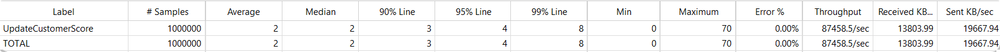
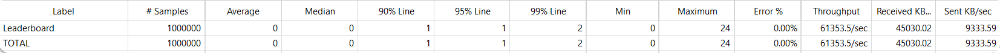
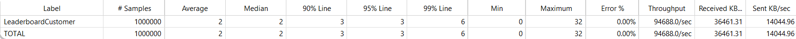
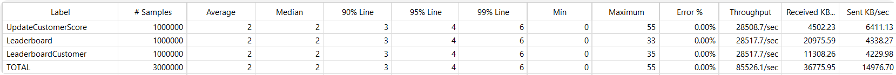

# Ranking

A high-performance leaderboard service implemented in .NET.

This project uses a ConcurrentDictionary + Snapshot architecture to achieve:
- O(1) write performance
- O(K) query performance
- O(N log N) leaderboard refresh

By using a background thread for asynchronous leaderboard refresh, expensive sorting operations are removed from the user request path, enabling extremely high query throughput.

# Architecture
The overall architecture is as follows:

            +--------------------+
            |   Update Score     |
            |       O(1)         |
            +---------+----------+
                    |
                    v
            ConcurrentDictionary
                (All user data)
                    |
                    | Trigger refresh
                    v
            Refresh Thread
            (Background leaderboard refresh)
                O(N logN)
                    |
                    v
            Snapshot List
            (Leaderboard snapshot)
                    |
                    |
            +---------+---------+
            |                   |
            v                   v
        GetLeaderboard()   GetCustomerLeaderboard()
            O(K)               O(K)

Key ideas:
- Write operations only modify the ConcurrentDictionary
- Leaderboard queries only access the Snapshot list
- The background thread periodically sorts and generates snapshots

# Time Complexity
| Operation              | Time Complexity | Description                    |
| ---------------------- | --------------- | ------------------------------ |
| UpdateScore            | **O(1)**        | Update a user's score          |
| GetLeaderboard         | **O(K)**        | Get leaderboard range          |
| GetCustomerLeaderboard | **O(K)**        | Get a user's nearby ranking    |
| RefreshLeaderboard     | **O(N log N)**  | Background leaderboard refresh |

# JMeter Benchmark
Test environment:
```
CPU: 8 cores / 16 threads
Memory: 64GB
.NET: .NET 10
OS: Linux
Initial data: 500k customers, 500k leaderboard entries
```
Leaderboard refresh latency: ~500 ms

Single-endpoint test results:




Aggregate test results:
